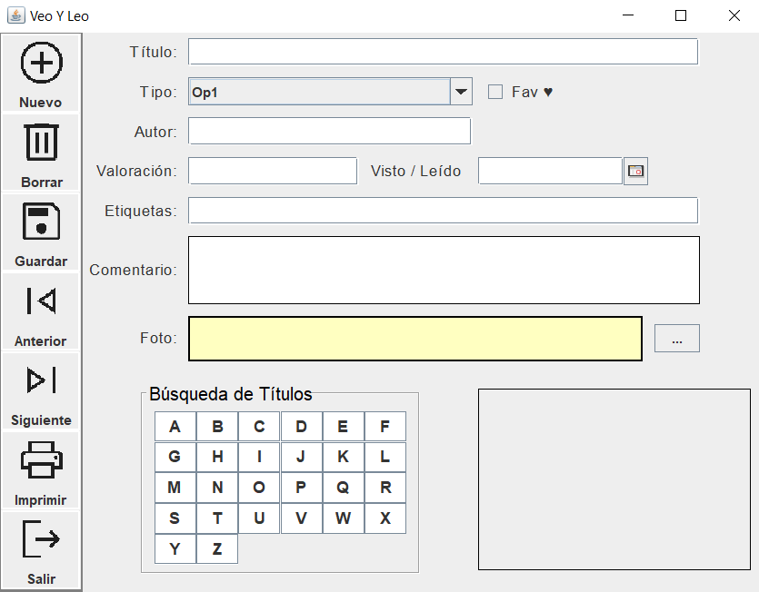
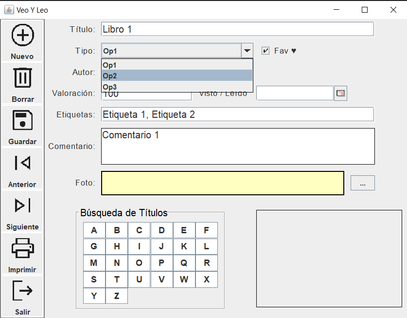
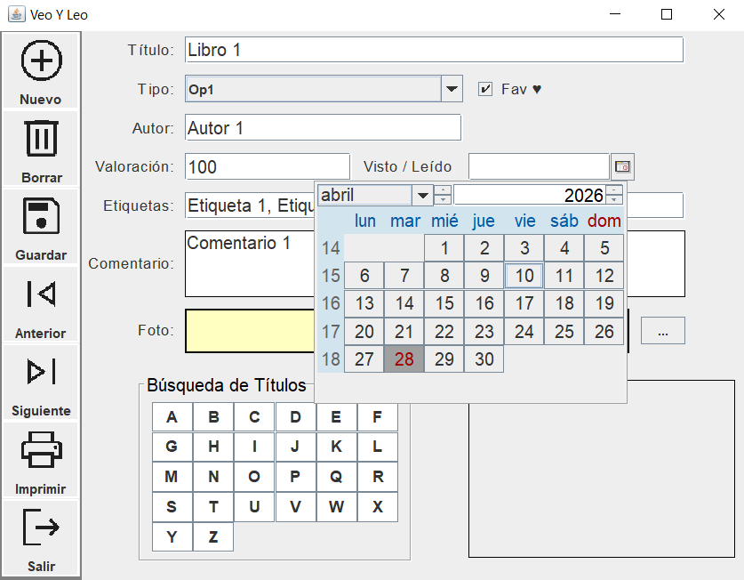

<h1 align="center">Veo Y Leo</h1>

Un gestor de libros leídos y opiniones

<h2>📌 Descripción del proyecto</h2>

Un proyecto creado en clase para entender y utilizar Swing

---

<h2>🛠️ Características principales</h2>

<ul>
  <li>CRUD básico de libros</li>
  <li>Gestión de datos en bases</li>
  <li>Gestion y seguiimiento de tus lecturas</li>
</ul>

---

<h2>🖥️ Capturas de la aplicación</h2>

<h3>Menú principal</h3>

<h3>Ajustes variados</h3>

<h3>Ajustes variados</h3>

---

<h2>🚀 Tecnologías utilizadas</h2>

<ul>
  <li>Java</li>
  <li>Swing</li>
</ul>

---

<h2>📌 Notas adicionales</h2>

Un proyecto hecho en clase como parte de nuestro aprendizaje, no desarrollado completamente por falta de tiempo, únicamente una tarea

